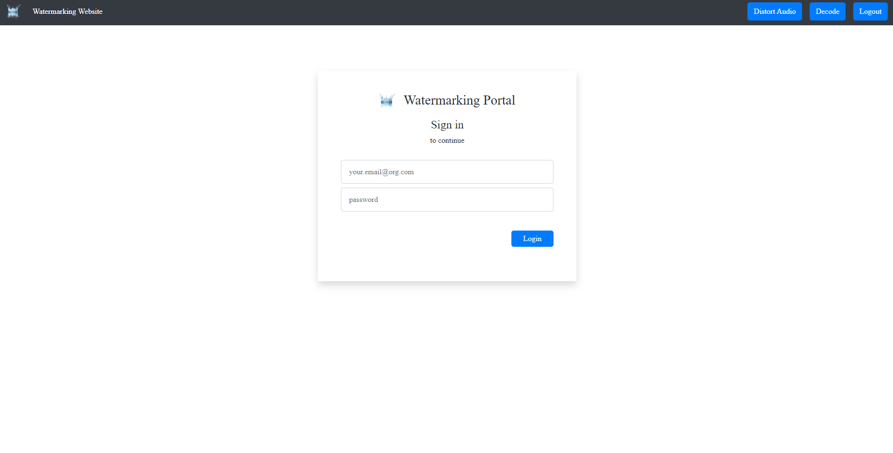
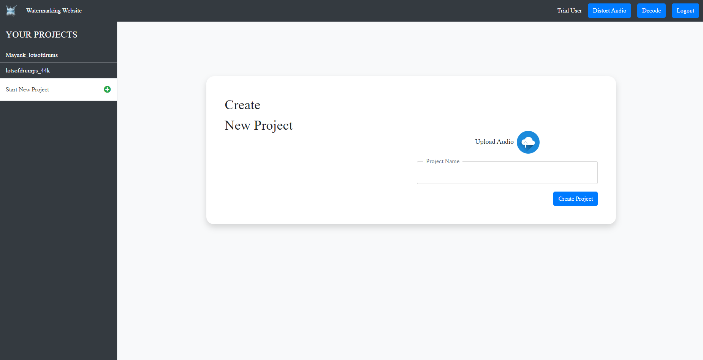
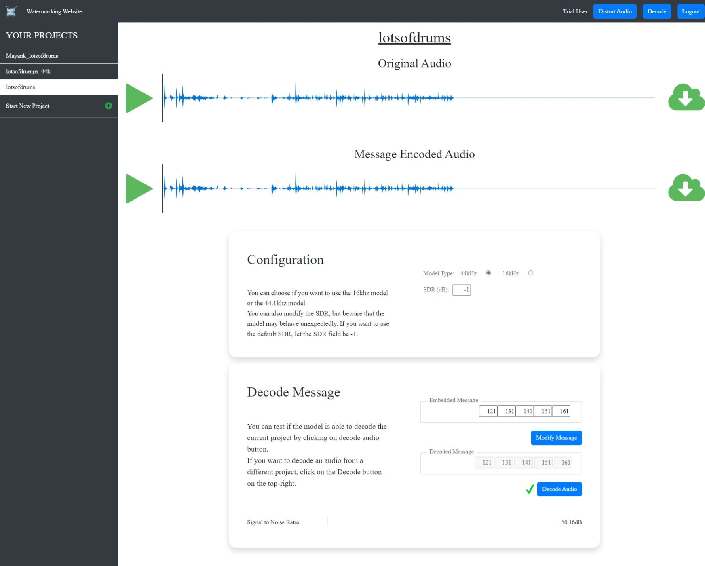
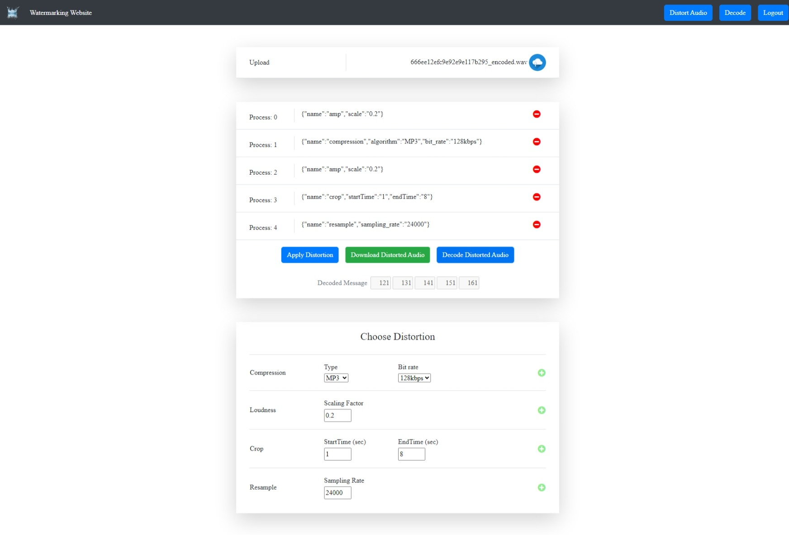
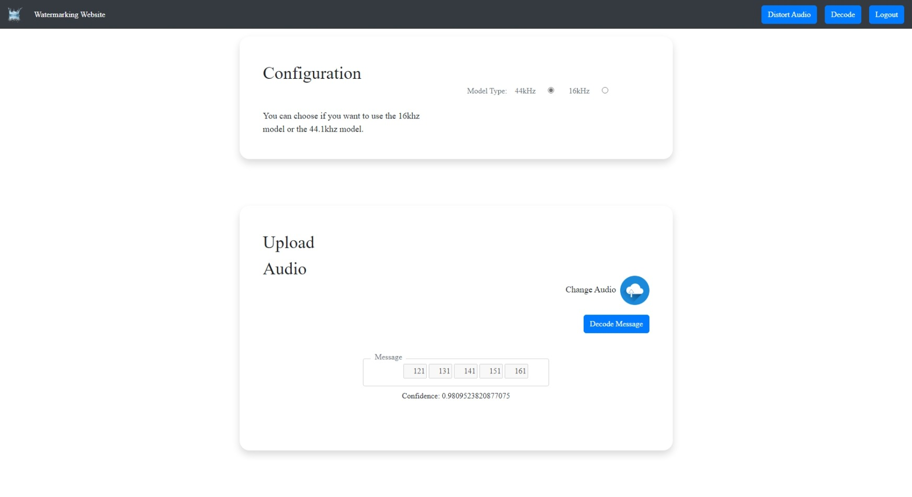

# Readme

This readme file provides information about the Django server and the Angular UI for the WaterMarkingWebsite project.

## Demo Images

### Login

### Create New Project

### Encode - Decode Project

### Distort and Decode Audio

### Decode Audio

## Silent Cipher Installation

Follow the installation instructions at [README.md](https://github.com/sony/silentcipher/blob/master/README.md)

## Django Server

The Django server is located at `examples/WaterMarkingWebsite/SERVER`. It serves as the backend for the WaterMarkingWebsite project.

To run the Django server, follow these steps:

1. Navigate to the server directory: `cd examples/WaterMarkingWebsite/SERVER`.
2. Install the required dependencies: `pip install -r requirements.txt`.
3. Install mongod on your server [INSTALLATION](https://www.mongodb.com/docs/manual/installation/)
4. Run the server: `python manage.py runserver 127.0.0.1:8000`.

The server will start running on `http://localhost:8000`.

## Angular UI

The Angular UI is located at `examples/WaterMarkingWebsite/silentcipherui`. It provides the frontend for the WaterMarkingWebsite project.

To run the Angular UI, follow these steps:

1. Navigate to the UI directory: `cd examples/WaterMarkingWebsite/silentcipherui`.
2. Install the required dependencies: `npm install`.
3. Start the development server: `ng serve`.

## Warning! You may face issues when installing the correct packages for angular...

The UI will be accessible at `http://localhost:4200`.

## Contributing

Currently the demo website only supports single channel audio 
Feel free to submit a PR for adding the multi-channel support to the demo website. 
Also feel free to submit a PR regarding installation challenges faced during the setup of the demo server 

## License

This project is licensed under the [MIT License](LICENSE).
